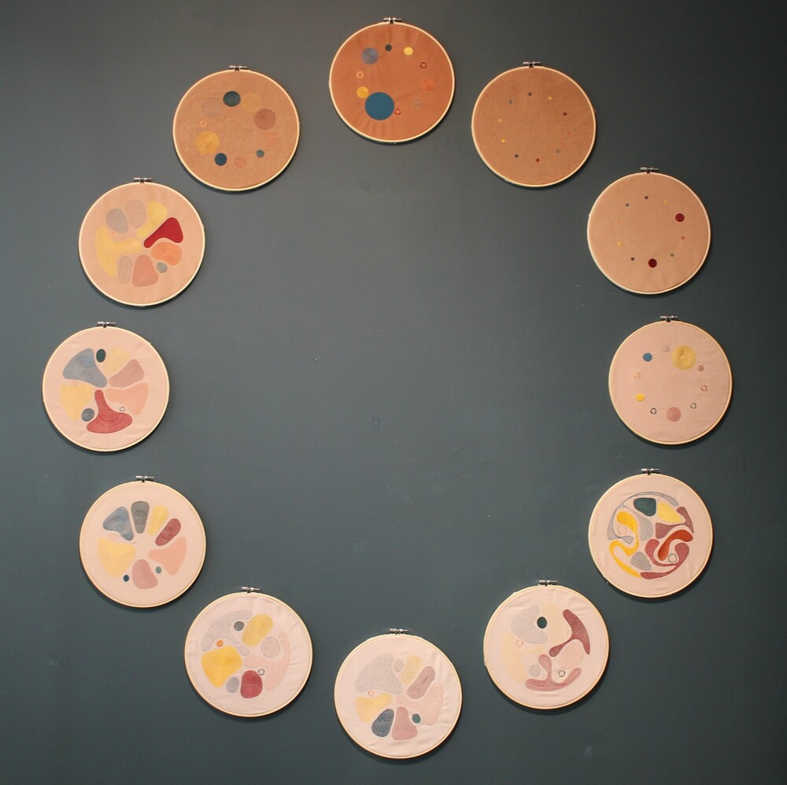
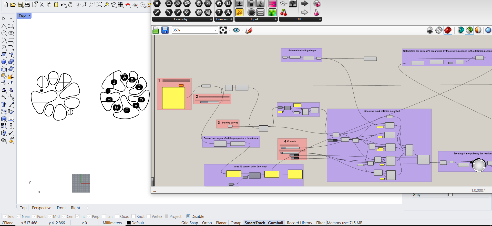
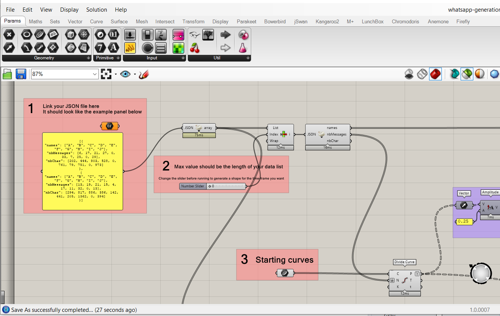
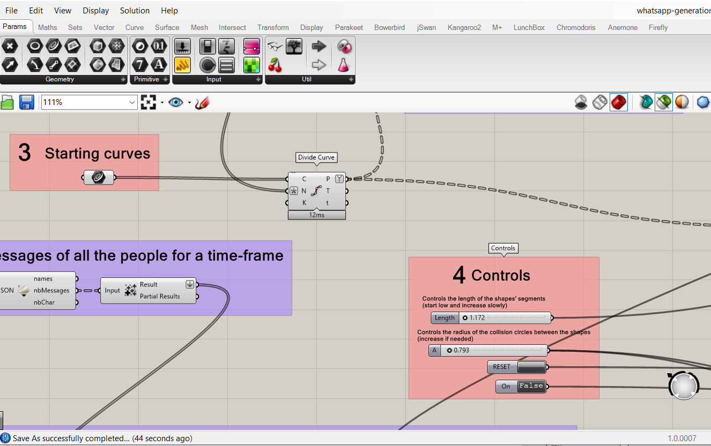

# Data Threads

The code in this repo is what I used to make my final [Fabricademy](https://textile-academy.org/) project in 2021.
These embroideries' designs were created using a WhatsApp group chat and generative design in Grasshopper.
They were then embroidered using a Brother PR670E embroidery machine.



This repository contains:

- The Python script I used to extract the data from WhatsApp
- The Grasshopper definition used to generate the design

All these come with sample inputs.


## WhatsApp data

Script usage :
```
pip install -r requirements.txt
cd whatsAppAnalyzer
python data-threads-whatsapp.py sample-chat-input.txt sample-output.json
```

**What it does**

It takes as an input an extracted WhatsApp chat, and outputs a JSON file with the data split in 2-hour timeframes, with for each person the number of messages, number of characters, number of emojis, and positivity rate for this group of messages.

The provided sample chat input shows an extracted chat from WhatsApp, from an iOS phone. It basically consists of one line for each message:
`[date time] Name: message`

An excerpt of the sample input file (the names were replaced with letters and some messages redacted):
```
[01/01/2020 00:05:30] B: *bonne année !!*
[01/01/2020 00:06:03] F: exemple de message 1
[01/01/2020 00:06:29] B: quoi ?!
[01/01/2020 00:06:33] A: Ca mérite un message audio
[01/01/2020 00:06:35] H: *hein
[01/01/2020 00:06:51] F: Effectivement
```

If you extract your file from an Android phone it will look a bit different:
`date, time - Firstname Lastname: message`
The script takes both versions into account.

The sample input data only contains a few messages, so the sample output is mostly empty, because not many hours are represented. It is only there so you can see the structure of it. Here is an excerpt:
```json
[
   {
      "names":["A","B","C","E","F","G","H"],
      "nbMessages":[1,3,1,1,2,1,1],
      "nbChar":[27,40,31,14,35,49,6],
      "positivity":[0,45,52,0,0,55,0]
   },
   [...]
   {
      "names":[],
      "nbMessages":[],
      "nbChar":[],
      "positivity":[]
   },
   {
      "names":["A","I"],
      "nbMessages":[1,2],
      "nbChar":[15,29],
      "positivity":[-10,-10]
   },
   {
      "names":["J"],
      "nbMessages":[1],
      "nbChar":[15],
      "positivity":[-10]
   },
   [...]
]

```

This output can be used as-is in the next part, the Grasshopper generation.


## Grasshopper generation

[Grasshopper](https://www.grasshopper3d.com/) comes bundled within [Rhino](https://www.rhino3d.com/). Rhino has a 90-days free trial, and a not-so-expensive student price.

To test this definition, you can open the Rhino .3dm file, then launch Grasshopper from Rhino and open the .gh file. The definition looks like this:



There are a few things you need to do in order to use it. Follow the numbers and the red groups to know what to update.

**Input file**
The first thing to do is input your JSON file. There is a panel showing what it should look like. It should already look like this if you followed the first part of this to extract the data from WhatsApp.

**Slider**
Depending on how many objects are in your JSON list, you should update the max value of the slider in the second box




**Starting curves**
In the third box, add your starting curves. They should be placed within the delimiting mesh shape at the top of the definition. Some example curves are provided in the .3dm file and already linked to the Grasshopper component, but you can add others or change them. Remember that they should reflect the number of people present in the group chat. You can also of course change the delimiting mesh shape as well.

**Controls**
This is where you will control the growth. When you've done everthing else, check that the length is at a low setting, press reset, and then toggle the start button. Then, increase the length slowly. Increase the collision radius if needed.


